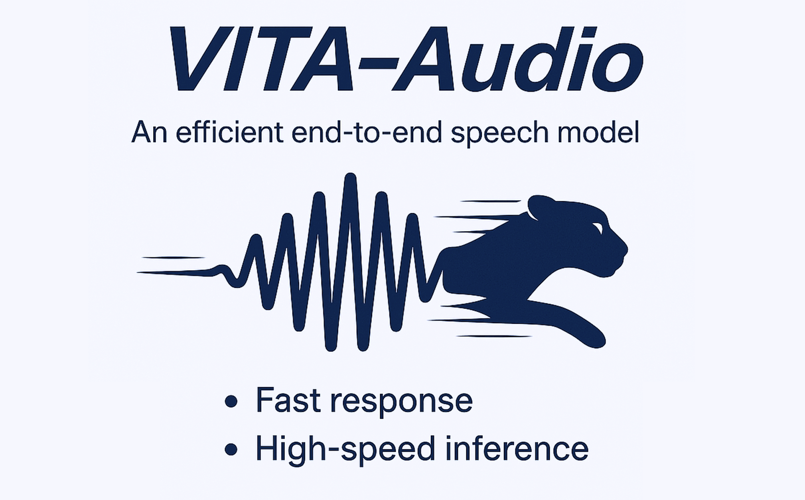

# VITA-Audio: Fast Interleaved Cross-Modal Token Generation for Efficient Large Speech-Language Model

<p align="center">
    
</p>


<font size=7><div align='center' > [[📖 VITA-Audio Paper](https://arxiv.org/abs/2505.03739)] [[🤖 Model Weight](https://huggingface.co/collections/VITA-MLLM/vita-audio-680f036c174441e7cdf02575)]  [[💬 WeChat (微信)](./asset/wechat-group.jpg)]</div></font>


## :fire: News


* **`2025.05.07`** 🌟 We are proud to launch VITA-Audio, an end-to-end large speech model with fast audio-text token generation.


## 📄 Contents <!-- omit in toc -->


- [Highlights](#-highlights)
- [Exhibition](#-exhibition)
- [Models](#-models)
- [Experimental Results](#-experimental-results)
- [Training](#-training)
- [Inference](#-inference)
- [Evaluation](#-evaluation)


## ✨ Highlights

- **Low Latency**. VITA-Audio is the first end-to-end speech model capable of generating audio during the initial forward pass. By utilizing a set of 32 prefill tokens, VITA-Audio reduces the time required to generate the first audio token chunk from 236 ms to just 53 ms.
- **Fast Inference**. VITA-Audio achieves an inference speedup of 3-5x at the 7B parameter scale.
- **Open Source**. VITA-Audio is trained on **open-source data** only, consisting of 200k hours of publicly available audio.
- **Strong Performance**. VITA-Audio achieves competitive results on ASR,TTS and SQA benchmarks among cutting-edge models under 7B parameters.
  


## 📌 Exhibition

### Inference Acceleration
Model inference speed under different inference modes.

<p align="center">
  
  
</p>

### Time to Generate the First Audio Segment In Streaming Inference
<div align="center">
  
</div>


### Generated Audio Case


> 打南边来了个哑巴，腰里别了个喇叭；打北边来了个喇嘛，手里提了个獭犸。  
> 提着獭犸的喇嘛要拿獭犸换别着喇叭的哑巴的喇叭；别着喇叭的哑巴不愿拿喇叭换提着獭玛的喇嘛的獭犸。  
> 不知是别着喇叭的哑巴打了提着獭玛的喇嘛一喇叭；还是提着獭玛的喇嘛打了别着喇叭的哑巴一獭玛。  
> 喇嘛回家炖獭犸；哑巴嘀嘀哒哒吹喇叭。

https://github.com/user-attachments/assets/38da791f-5d72-4d9c-a9b2-cec97c2f2b2b


---

> To be or not to be--to live intensely and richly,
> merely to exist, that depends on ourselves. Let widen and intensify our relations.   
> While we live, let live!  

https://github.com/user-attachments/assets/fd478065-4041-4eb8-b331-0c03b304d853


---

> The hair has been so little, don't think about it, go to bed early, for your hair. Good night!

https://github.com/user-attachments/assets/4cfe4742-e237-42bd-9f17-7935b2285799


---
> 两个黄鹂鸣翠柳，
> 一行白鹭上青天。  
> 窗含西岭千秋雪，
> 门泊东吴万里船。

https://github.com/user-attachments/assets/382620ee-bb2a-488e-9e00-71afd2342b56


---


## :label: TODO 

- [x] Release training code and inference code.
- [x] Release checkpoints.
- [x] Release VITA-Audio-Plus.
- [ ] Release the cleaned open-source data JSON and audio.


## 🔔 Models

| Model                   | LLM Size | Huggingface Weights                                           |
|-------------------------|----------|---------------------------------------------------------------|
| VITA-Audio-Boost        | 7B       | https://huggingface.co/VITA-MLLM/VITA-Audio-Boost             |
| VITA-Audio-Balance      | 7B       | https://huggingface.co/VITA-MLLM/VITA-Audio-Balance           |
| VITA-Audio-Plus-Vanilla | 7B       | https://huggingface.co/VITA-MLLM/VITA-Audio-Plus-Vanilla      |
| VITA-Audio-Plus-Boost| 7B       | https://huggingface.co/VITA-MLLM/VITA-Audio-Plus-Boost     |


## 📈 Experimental Results
- **Comparison of Spoken Question Answering**.


- **Comparison of Text to Speech**.


- **Comparison of Automatic Speech Recognition**.


- **Effectiveness of Inference Acceleration**.


## 📔 Requirements and Installation

### Prepare Environment
```
docker pull shenyunhang/pytorch:24.11-py3_2024-1224
```

### Get the Code
```
git clone https://github.com/VITA-MLLM/VITA-Audio.git
cd VITA-Audio
git submodule update --init --recursive
pip install -r requirements_ds_gpu.txt
pip install -e .
```

### Prepare Pre-trained Weight

#### LLM

- Download the LLM from https://huggingface.co/Qwen/Qwen2.5-7B-Instruct.
- Put it into '../models/Qwen/Qwen2.5-7B-Instruct/'

#### Audio Encoder and Audio Decoder

- Download the Audio Encoder from https://huggingface.co/THUDM/glm-4-voice-tokenizer.
- Put it into '../models/THUDM/glm-4-voice-tokenizer'

- Download the Audio Decoder from https://huggingface.co/THUDM/glm-4-voice-decoder.
- Put it into '../models/THUDM/glm-4-voice-decoder'


### Data Format
#### **Speech QA Data Format**


```jsonc
{
  "messages": [
    {
      "content": "<|audio|>",
      "role": "user"
    },
    {
      "content": "好的，这样排列更合理：这些生物废弃物如鸡蛋壳、蛤壳、贻贝壳比其他工业废渣更有价值。研究表明，它们在能源、材料、环境保护等领域有广泛应用。高效利用贝壳能提高资源利用效率，减少废弃物，减轻环境负担。特别是在这些领域中，鸡蛋壳因为含有丰富的钙元素，被用于制造医药品和肥料。\n<|audio|>",
      "role": "assistant"
    }
  ],
  "audios": [
    "datasets/VITA-MLLM/AudioQA-1M/QA_1450K_question_tar/question_shuf_part_8/wav/000000200014510ac1fd776006fc66b36f7f3cda76_question.wav",
    "datasets/VITA-MLLM/AudioQA-1M/QA_1450K_answer_part1_tar/answer_part1_shuf_part_3/wav/000000200114510ac1fd776006fc66b36f7f3cda76_F10.wav"
  ]
}
```

#### **ASR Data Format**


```jsonc
{
  "messages": [
    {
      "content": "Convert the speech to text.\n<|audio|>",
      "role": "user"
    },
    {
      "content": "没有跟大家说是在做什么",
      "role": "assistant"
    }
  ],
  "audios": [
    "datasets/wenet-e2e/wenetspeech/data/cuts_L_fixed.00000000/X00/X0000016296_135343932_S00019.wav"
  ]
}
```

#### **TTS Data Format**


```jsonc
{
  "messages": [
    {
      "content": "Convert the text to speech.\n那我情愿无药可救。",
      "role": "user"
    },
    {
      "content": "<|audio|>",
      "role": "assistant"
    }
  ],
  "audios": [
    "datasets/Wenetspeech4TTS/WenetSpeech4TTS/Premium/WenetSpeech4TTS_Premium_9/wavs/X0000001735_50639692_S00035.wav"
  ]
}
```

## 🎲 Training


The following tutorial will take `VITA-Audio-Boost` as an example.

- To train `VITA-Audio-Balance` and other variants, you should modify the `text-audio-interval-ratio`.

  VITA-Audio-Boost:
  ```
  --text-audio-interval-ratio 1 10 4 10 \
  ```

  VITA-Audio-Balance:
  ```
  --text-audio-interval-ratio 1 4 3 8 4 10 \
  ```

- To train `VITA-Audio-Plus-*`, you should use the script like `scripts/deepspeed/sts_qwen25/finetune_sensevoice_glm4voice...`

### Stage-1 (Audio-Text Alignment)

```
bash scripts/deepspeed/sts_qwen25/finetune_glm4voice_stage1.sh 8192 `date +'%Y%m%d_%H%M%S'`
```

The above script may need some adjustments.

- Set `ROOT_PATH` to your code root folder.
- Set `LOCAL_ROOT_PATH` to a temporary code root folder.
- Modify other variables as needed for your environment.

### Stage-2 (Single MCTP Module Training)

```
bash scripts/deepspeed/sts_qwen25/finetune_glm4voice_mtp1_stage1.sh 8192 `date +'%Y%m%d_%H%M%S'`
```

The above script may need some adjustments.

- Set `ROOT_PATH` to your code root folder.
- Set `LOCAL_ROOT_PATH` to a temporary code root folder.
- Set `MODEL_NAME_OR_PATH` to the path of the model trained in Stage 1.
- Modify other variables as needed for your environment.

### Stage-3 (Multiple MCTP Modules Training)

```
bash scripts/deepspeed/sts_qwen25/finetune_glm4voice_mtp10_stage1.sh 8192 `date +'%Y%m%d_%H%M%S'`
```

The above script may need some adjustments.

- Set `ROOT_PATH` to your code root folder.
- Set `LOCAL_ROOT_PATH` to a temporary code root folder.
- Set `MODEL_NAME_OR_PATH` to the path of the model trained in Stage 2.
- Modify other variables as needed for your environment.

### Stage-4 (Supervised Fine-tuning)

```
bash scripts/deepspeed/sts_qwen25/finetune_glm4voice_mtp10_stage2.sh 2048 `date +'%Y%m%d_%H%M%S'`
```

The above script may need some adjustments.

- Set `ROOT_PATH` to your code root folder.
- Set `LOCAL_ROOT_PATH` to a temporary code root folder.
- Set `MODEL_NAME_OR_PATH` to the path of the model trained in Stage 3.
- Modify other variables as needed for your environment.


## 📐 Inference

Here we implement a simple script for inference.

It includes examples of speech-to-speech, ASR, and TTS tasks, as well as streaming and non-streaming inference speed testing.

```
python tools/inference_sts.py
```

- Set `model_name_or_path` to VITA-Audio weights.
- Set `audio_tokenizer_path` to the path of the audio encoder.
- Set `flow_path` to the path of the audio decoder.


## 🔎 Evaluation

Evaluate SQA, ASR, and TTS benchmarks
```
bash scripts/deepspeed/evaluate_sts.sh
```


## &#x1F4E3; Statement

**VITA-Audio is trained on large-scale open-source corpus, and its output has randomness. Any content generated by VITA-Audio does not represent the views of the model developers. We are not responsible for any problems arising from the use, misuse, and dissemination of VITA-Audio, including but not limited to public opinion risks and data security issues.**


## :black_nib: Citation

If you find our work helpful for your research, please consider citing the following BibTeX entry.   


```bibtex
@misc{,
      title={VITA-Audio: Fast Interleaved Cross-Modal Token Generation for Efficient Large Speech-Language Model}, 
      author={Zuwei Long and Yunhang Shen and Chaoyou Fu and Heting Gao and Lijiang Li and Peixian Chen and Mengdan Zhang and Hang Shao and Jian Li and Jinlong Peng and Haoyu Cao and Ke Li and Rongrong Ji and Xing Sun},
      year={2025},
      eprint={2505.03739},
      archivePrefix={arXiv},
      primaryClass={cs.CL},
      url={https://arxiv.org/abs/2505.03739}, 
}
```
