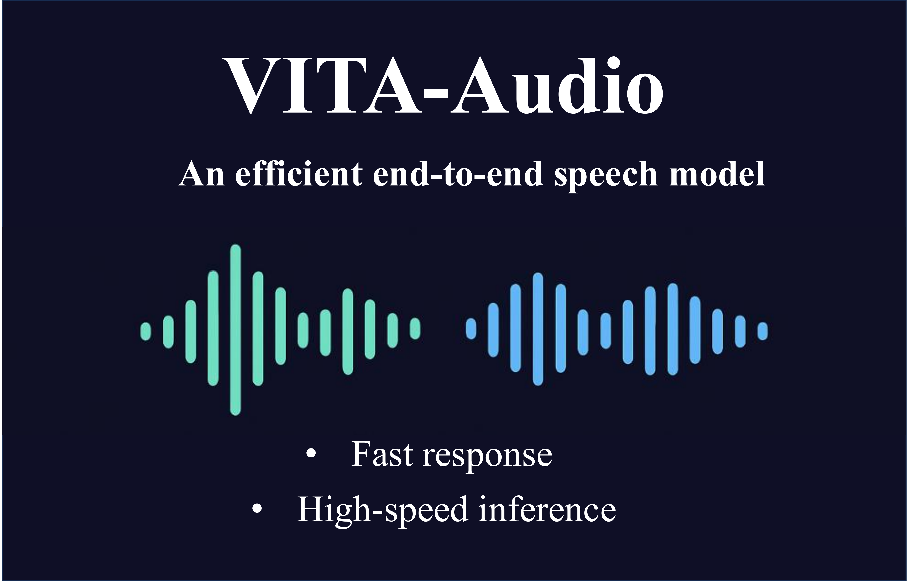

# VITA-Audio: Fast Interleaved Audio-Text Token Generation for Efficient Large Speech-Language Model

<p align="center">
    
</p>

<p align="center">
    <a href="https://arxiv.org/abs/2502.05177" target="_blank"></a>
    <a href="https://huggingface.co/collections/VITA-MLLM/vita-audio-680f036c174441e7cdf02575" target="_blank"></a>
 </p>


## :fire: News


* **`2025.05.06`** 🌟 We are proud to launch VITA-Audio, an end-to-end large speech model with fast audio-text token generation.


## Contents <!-- omit in toc -->


- [Highlights](#-highlights)
- [Experimental Results](#-experimental-results)
- [Models](#-models)
- [Training, Inference and Evaluation](#-training-inference-and-evaluation)


## ✨ Highlights

- **Low Latency**. VITA-Audio is the first end-to-end speech model capable of generating audio during the initial forward pass. By utilizing a set of 32 prefill tokens, VITA-Audio reduces the time required to generate the first audio token chunk from 217 ms to just 47 ms.
- **Fast Inference**. VITA-Audio achieves an inference speedup of 3-5x at the 7B parameter scale.
- **Open Source**. VITA-Audio is trained on **open-source data** only, consisting of 200k hours of publicly available audio.
- **Strong Performance**. VITA-Audio achieves competitive results on ASR,TTS and SQA benchmarks among cutting-edge models under 7B parameters.
  


<p align="center">
  
  
</p>


## 🐍 Models

| Model                   | LLM Size | Huggingface Weights                                           |
|-------------------------|----------|---------------------------------------------------------------|
| VITA-Audio-Boost        | 7B       | https://huggingface.co/VITA-MLLM/VITA-Audio-Boost             |
| VITA-Audio-Balance      | 7B       | https://huggingface.co/VITA-MLLM/VITA-Audio-Balance           |
| VITA-Audio-Plus-Vanilla | 7B       | https://huggingface.co/VITA-MLLM/VITA-Audio-Plus-Vanilla      |


## 📈 Experimental Results
- **Comparison of Spoken Question Answering**.


- **Comparison of Automatic Text to Speech**.


- **Comparison of Automatic Speech Recognition**.


- **Effectiveness of Inference Acceleration**.


## Requirements and Installation

```
git clone https://github.com/VITA-MLLM/VITA-Audio.git
cd VITA-Audio
pip install -r requirements_ds_gpu.txt
pip install -e .
```

### Prepare Pre-trained Weight

### LLM
- Download the LLM from https://huggingface.co/Qwen/Qwen2.5-7B-Instruct.
- Put it into '../models/Qwen/Qwen2.5-7B-Instruct/'

### Audio Encoder and Audio Decoder
- Download the Audio Encoder from https://huggingface.co/THUDM/glm-4-voice-tokenizer.
- Put it into '../models/THUDM/glm-4-voice-tokenizer'

- Download the Audio Decoder from https://huggingface.co/THUDM/glm-4-voice-decoder.
- Put it into '../models/THUDM/glm-4-voice-decoder'


## Training
### Stage-1 (Audio-Text Alignment)

```
bash scripts/deepspeed/sts_qwen25/finetune_glm4voice_stage1.sh 8192 `date +'%Y%m%d_%H'`0000
```

The above script may need some adjustment.

- Set `ROOT_PATH` to your code root folder.
- Set `LOCAL_ROOT_PATH` to a temporary code root folder.
- Modify other variables as needed for your environment.

### Stage-2 (Single MCTP Module Training)

```
bash scripts/deepspeed/sts_qwen25/finetune_glm4voice_mtp1_stage1.sh 8192 `date +'%Y%m%d_%H'`0000
```

The above script may need some adjustment.

- Set `ROOT_PATH` to your code root folder.
- Set `LOCAL_ROOT_PATH` to a temporary code root folder.
- Set `MODEL_NAME_OR_PATH` to the path of the model trained in Stage 1.
- Modify other variables as needed for your environment.

### Stage-3 (Multiple MCTP Modules Training)

```
bash scripts/deepspeed/sts_qwen25/finetune_glm4voice_mtp10_stage1.sh 8192 `date +'%Y%m%d_%H'`0000
```

The above script may need some adjustment.

- Set `ROOT_PATH` to your code root folder.
- Set `LOCAL_ROOT_PATH` to a temporary code root folder.
- Set `MODEL_NAME_OR_PATH` to the path of the model trained in Stage 2.
- Modify other variables as needed for your environment.

### Stage-4 (Supervised Fine-tuning)

```
bash scripts/deepspeed/sts_qwen25/finetune_glm4voice_mtp10_stage2.sh 8192 `date +'%Y%m%d_%H'`0000
```

The above script may need some adjustment.

- Set `ROOT_PATH` to your code root folder.
- Set `LOCAL_ROOT_PATH` to a temporary code root folder.
- Set `MODEL_NAME_OR_PATH` to the path of the model trained in Stage 3.
- Modify other variables as needed for your environment.


## 📐Inference

We provide the converted Huggingface weights in

- https://huggingface.co/VITA-MLLM/VITA-Audio-Boost 
- https://huggingface.co/VITA-MLLM/VITA-Audio-Balance 


- Set `model_name_or_path` to your VITA-Audio weights.
- Set `audio_tokenizer_path` to the path of the audio encoder.
- Set `flow_path` to the path of the audio decoder.


Here we implement a simple script for inference
```
python tools/inference_sts.py
```


## Evaluation

Evaluate with benchmarks
```
bash scripts/deepspeed/evaluate_sts.sh 1024 `date +'%Y%m%d_%H'`0000
```


